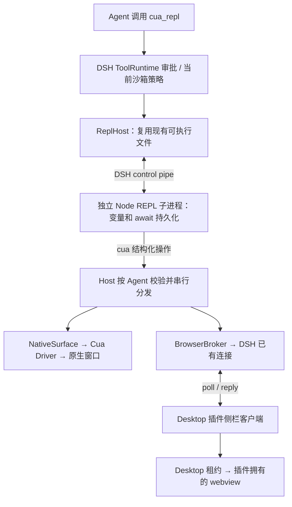

# DSH Unified Computer Use

Persistent `cua_repl` and plugin-owned browser tabs using DSH's installed runtime. **Experimental host backend, 0.2.0-alpha.3.** MIT.

本分支把 Computer Use 接到现有 DSH Node 运行时和 Desktop 浏览器接口，默认**不下载、不启动额外 Electron，也不需要 DSH 补丁**。它尚未达到 YouDesktop PR #61 的完整能力：**host 模式没有独立实时 PiP**，也没有完整 Playwright / 可信键鼠输入。

已发布的 `v0.1.1` tag 仍是独立 Electron companion 实现，安装它仍会在首次使用时准备 Electron。当前 host 实现仍为 alpha，尚未发布稳定版 tag。旧架构说明见 [README.companion.md](README.companion.md)。

## 当前验证范围

- 真实 `dsh plugin add` 安装本地 bundle、激活、审批、持久变量、跨调用 `await`、原生权限查询、取消 / 超时回收已验证。
- 已使用 `/Applications/DeepSeek Harness.app` 自带的 **Electron 44.0.0 / Node 24.18.1** 在 Node 模式运行上述安装测试；无需新下载运行时。
- DSH 沙箱模式切换会重置旧 REPL；真实 read-only 沙箱拒绝写文件已验证。
- 已在**已安装的 DSH Desktop** 中通过插件管理器安装、启用并重启，实际调用 `cua_repl` 打开网页：工具返回 `Example Domain`，右侧 Computer Use 面板显示该网页。持久变量跨调用返回 `2`、`3` 也已通过 UI 验证。
- 实际插件客户端配合**未修改的 DSH 浏览器租约及 preload**，另在测试夹具中验证了 DOM 填写、DOM 点击、截图、跨会话拒绝及释放；这些扩展操作尚未逐项在已安装 Desktop 中验收。
- 支持及测试目标：DSH **0.2.0-rc.2**、macOS Apple Silicon。浏览器测试夹具使用已有 Electron **44.7.0**；不能等同于已安装 Desktop 的完整 UI 验收。

详细证据见 [VERIFICATION.md](VERIFICATION.md)。此 alpha 用于开发验证，暂不建议替换日常使用版本。

## 安装

### DSH Desktop（使用内置浏览器）

在「插件」→「添加插件」中填写公开实验分支：

```text
github:xiaoiver/dsh-unified-computer-use#feat/dsh-host-runtime
```

安装并启用后，完全退出并重新打开 Desktop，清除旧模块缓存。此来源会跟随实验分支更新；`v0.1.1` 仍是旧 companion 版本。`desktop` profile 由 Desktop 管理，不能使用 `dsh plugin --profile desktop add`。

打开新会话后可输入：

> 使用 cua_repl 打开 https://example.com，读取网页标题并保留标签页。

批准该 cell 后，右侧应出现 Computer Use 面板，工具返回标题 `Example Domain`。

### 普通 CLI / Web profile

```sh
dsh plugin --profile cua-test add github:xiaoiver/dsh-unified-computer-use#feat/dsh-host-runtime
```

可使用持久 REPL 和本机原生 SDK；普通 Web 页面不具备 Desktop bridge，因此不能使用本插件的内置浏览器。

### 从源码构建本地 bundle

```sh
git clone --branch feat/dsh-host-runtime https://github.com/xiaoiver/dsh-unified-computer-use.git
cd dsh-unified-computer-use
npm ci --ignore-scripts
npm run build
npm run typecheck
npm test
npm pack --ignore-scripts
```

在 Desktop「添加插件」中输入生成的 `.tgz` **绝对路径**，然后安装、启用并重启应用。

默认 `backend: host` 注册 `cua_repl` / `cua_repl_reset`。原生操作必须让 Host 运行在本机图形桌面会话中；浏览器还需要本机 DSH Desktop、插件客户端已加载，以及调用所属会话当前可见。工具获准后，浏览器面板自动打开。

原生应用操作仍需要系统实际授予 DSH Host 的辅助功能 / 屏幕录制权限。插件不自动弹出授权申请、不绕过系统权限。

## REPL 用法

JavaScript，而非 TypeScript。`let` / `const`、对象引用及顶层 `await` 可跨调用保留。

```js
let count = 1;
nodeRepl.write(++count);
```

下一次 `cua_repl` 调用可继续 `nodeRepl.write(++count)`。

```js
nodeRepl.write(await cua.getState());        // 原生应用列表
nodeRepl.write(await cua.listWindows(pid));
let app = await cua.getApp({ pid, windowId });
nodeRepl.write(await app.getState());
// 仅使用本次观察的 element_token；每次输入前观察，输入后验证。
await app.act('click', { element_token });
```

```js
let tab = await cua.createBrowserTab('https://example.com');
nodeRepl.write(await tab.getState());
// 从观察结果选取 ref：
await tab.fill(ref, 'text');
await tab.click(buttonRef);
```

其他入口：`tab.navigate(url)`、`tab.scroll(y,x)`、`tab.close()`、`cua.getTab(targetId)`。浏览器只支持插件自己创建的标签；点击和填写使用 DOM 操作，`press` 暂不支持。页面 / 应用内容作为不可信数据处理。

需要截图时使用 `cua.native({action:'observe',target:app.id,screenshot:true})` 或 `cua.browser({action:'observe',target:tab.id,screenshot:true})`，再把返回的 image 内容传给 `nodeRepl.emitImage({data,mimeType})`。`nodeRepl.write(value)` 输出文本。

审批覆盖整个 JavaScript cell，其中可能包含多次操作。Node API 及文件访问遵守 DSH 当前会话沙箱；不是只允许 `cua` 的 JavaScript 沙箱。不要创建后台定时任务或后台进程。取消 / 超时 / 重置 / 空闲过期会销毁 REPL 和目标；结果不确定的输入不会自动重放。文件和网页的既有修改不会因重置而撤销。

## 配置

| 字段 | 默认值 | 作用 |
| --- | --- | --- |
| `backend` | `host` | 复用 DSH；`companion` 显式选择旧版独立 Electron |
| `approval` | `ask` | 每个 REPL cell 审批；`inherit` 使用 DSH 原有决策 |
| `timeoutMs` | `30000` | 每次调用的默认时限；`timeout_ms` 可覆写至 120000 |
| `idleTimeoutMs` | `600000` | 空闲多久后清理会话资源 |
| `native` | `true` | 启用原生 SDK |
| `maxTargets` | `12` | 原生目标上限；浏览器当前固定上限 12 |

`pip`、`electronExecutable`、`runtimeDirectory`、`startupTimeoutMs` 仅用于旧 `companion` 后端，host 后端不会因为设置 `pip: true` 而获得 PiP。若显式选择旧后端，请同时设置 `pip: true` 以启用其预览；工具变为旧版 `cua`。

## 架构与限制



**[查看详细调用图](docs/CALL-FLOWS.md)**：包含进程边界、REPL 执行与结果回传、浏览器租约、原生输入校验，以及取消 / 重置 / 资源释放五组图，并链接到实际源码。

“复用运行时”仍会创建独立 Node REPL 子进程；它使用 Host 的 `process.execPath`，无需准备另一套 Electron。原生 SDK 在 Host 侧执行，网页由现有 Desktop 的 guest 进程承载。

浏览器操作走 DSH 已有认证连接，没有额外监听端口。客户端只能访问本插件创建的目标；租约由 DSH 绑定到主窗口，网页仍使用 DSH 的沙箱和权限策略。宿主会在每次调用前解析当前会话沙箱；策略变化时销毁旧解释器，不沿用旧权限。

REPL 使用 Node 内置解释器；其异常通道适配目前验证了 Node 24.18.1，其他 Node 版本尚未验收。DSH 程序化工具调用运行时本身是无状态的，因此这里用已有 subprocess/sandbox 接口维护解释器生命周期。

仍缺：浏览器可信键鼠输入、完整 Playwright / CDP、现有标签接管、独立实时 PiP。没有用截图轮询冒充视频 PiP。
