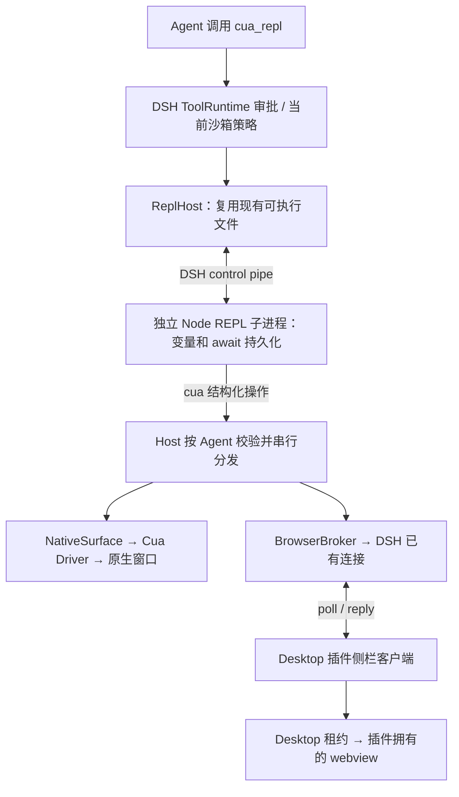

# DSH Unified Computer Use

Persistent `cua_repl` and plugin-owned browser tabs using DSH's installed runtime. **Experimental.** 已发布：0.2.0-alpha.4；当前源码：0.2.0-alpha.5（尚未发布）。 MIT.

本插件把 Computer Use 接到现有 DSH Node 运行时和 Desktop 浏览器接口，**不下载、不启动额外 Electron，也不需要 DSH 补丁**。当前为预览版本：**目前没有独立实时 PiP**，也没有完整 Playwright / 可信键鼠输入。

## 安装

已测试环境：**DSH 0.2.0-rc.2、macOS Apple Silicon**。详细验证记录见 [VERIFICATION.md](VERIFICATION.md)。

### DSH Desktop（使用内置浏览器）

在「插件」→「添加插件」中填写固定预览版本：

```text
github:xiaoiver/dsh-unified-computer-use#v0.2.0-alpha.4
```

安装并启用后，完全退出并重新打开 Desktop，清除旧模块缓存。该标签固定插件源码版本；新版本会使用新标签发布，不跟随 main 漂移。`desktop` profile 由 Desktop 管理，不能使用 `dsh plugin --profile desktop add`。

打开新会话后可输入：

> 打开 https://example.com，读取网页标题并保留标签页。

无需每次指定工具名，模型会根据任务选择工具；需要明确指定时，也可以说“使用 cua_repl”。

若 DSH 要求审批，按其提示批准。执行后右侧应出现 Computer Use 面板，工具返回标题 `Example Domain`。

### 普通 CLI / Web profile

```sh
dsh plugin --profile cua-test add github:xiaoiver/dsh-unified-computer-use#v0.2.0-alpha.4
```

可使用持久 REPL 和本机原生 SDK；普通 Web 页面不具备 Desktop bridge，因此不能使用本插件的内置浏览器。

### 从源码构建本地 bundle

```sh
git clone --branch v0.2.0-alpha.4 https://github.com/xiaoiver/dsh-unified-computer-use.git
cd dsh-unified-computer-use
npm ci --ignore-scripts
npm run build
npm run typecheck
npm test
npm pack --ignore-scripts
```

在 Desktop「添加插件」中输入生成的 `.tgz` **绝对路径**，然后安装、启用并重启应用。

也可从 [v0.2.0-alpha.4 Pre-release](https://github.com/xiaoiver/dsh-unified-computer-use/releases/tag/v0.2.0-alpha.4) 下载已打包的 `.tgz` 和 `SHA256SUMS`。把两者放在同一目录，执行 `shasum -a 256 -c SHA256SUMS` 校验，再通过 Desktop 插件管理器安装 `.tgz` 的绝对路径。Release 提供固定安装包；运行仍要求上文已测试的 DSH 版本与系统环境。

插件只注册 `cua_repl` / `cua_repl_reset`。原生操作必须让 Host 运行在本机图形桌面会话中；浏览器还需要本机 DSH Desktop、插件客户端已加载，以及调用所属会话当前可见。工具获准后，浏览器面板自动打开。

原生应用操作仍需要系统实际授予 DSH Host 的辅助功能 / 屏幕录制权限。插件不自动弹出授权申请、不绕过系统权限。

## REPL 用法

JavaScript，而非 TypeScript。`let` / `const`、对象引用及顶层 `await` 可跨调用保留。

```js
let count = 1;
nodeRepl.write(++count);
```

下一次 `cua_repl` 调用可继续 `nodeRepl.write(++count)`。

```js
nodeRepl.write(await cua.getState());        // 原生应用列表
nodeRepl.write(await cua.listWindows(pid));
let app = await cua.getApp({ pid, windowId });
nodeRepl.write(await app.getState());
// 仅使用本次观察的 element_token；每次输入前观察，输入后验证。
await app.act('click', { element_token });
```

```js
let tab = await cua.createBrowserTab('https://example.com');
nodeRepl.write(await tab.getState());
// 从观察结果选取 ref：
let filled = await tab.fill(ref, 'text');
// 从 filled 的新观察中选取 buttonRef，再点击：
await tab.click(buttonRef);
```

其他入口：`tab.navigate(url)`、`tab.scroll(y,x)`、`tab.close()`、`cua.getTab(targetId)`。浏览器只支持插件自己创建的标签；点击和填写使用 DOM 操作，`press` 暂不支持。页面 / 应用内容作为不可信数据处理。

需要截图时使用 `cua.native({action:'observe',target:app.id,screenshot:true})` 或 `cua.browser({action:'observe',target:tab.id,screenshot:true})`，再把返回的 image 内容传给 `nodeRepl.emitImage({data,mimeType})`。`nodeRepl.write(value)` 输出文本。

工具审批由 DSH 统一决定，插件不额外要求确认。审批单位为整个 JavaScript cell，其中可能包含多次操作。Node API 及文件访问遵守 DSH 当前会话沙箱；不是只允许 `cua` 的 JavaScript 沙箱。不要创建后台定时任务或后台进程。取消 / 超时 / 重置 / 空闲过期会销毁 REPL 和目标；结果不确定的输入不会自动重放。文件和网页的既有修改不会因重置而撤销。

## 配置

是否需要手动确认由 DSH 的统一工具审批策略决定。当前源码不再提供插件级 `approval` 配置或额外审批逻辑。

**以下配置页面在当前 alpha.5 源码中提供，已发布的 alpha.4 尚无此页面。** 本地测试当前源码时，在当前 checkout 运行上面的构建、打包命令，再通过 Desktop 插件管理器安装 `.tgz` 并重启。

打开「Plugins → dsh-unified-computer-use」，在插件详情中修改后点击「保存 / Save」。表单复用 DSH 官方插件的设置组件，跟随 Desktop 的主题和中英文语言设置。表单仅提供保存，不提供恢复默认或重新载入按钮：

- **启用原生应用操作**：关闭后禁止通过此工具调用原生 SDK；内置浏览器仍可使用。
- **高级设置**：调用超时、空闲释放时间以秒显示，另可调整原生目标数量上限。

保存后配置立即可读，无需重启；正在执行的调用保留原超时时限。空闲时限在下一次调用结束时重新计时，降低目标上限不会主动关闭已有目标。修改会保存到 DSH 当前 profile，并在应用重启后恢复。如果其他页面同时更新设置，旧修改会被拒绝，重新打开插件页面读取最新值后再编辑。页面仅在可写的本机 Host 连接下允许保存。

底层字段如下（超时仍以毫秒保存）：

| 字段 | 默认值 | 作用 |
| --- | --- | --- |
| `timeoutMs` | `30000` | 每次调用的默认时限；`timeout_ms` 可覆写至 120000 |
| `idleTimeoutMs` | `600000` | 空闲多久后清理会话资源 |
| `native` | `true` | 启用原生 SDK |
| `maxTargets` | `12` | 原生目标上限；浏览器当前固定上限 12 |

## 架构与限制



**[查看详细调用图](docs/CALL-FLOWS.md)**：包含进程边界、REPL 执行与结果回传、浏览器租约、原生输入校验，取消 / 重置 / 资源释放，以及配置保存与动态生效的调用图，并链接到实际源码。

“复用运行时”仍会创建独立 Node REPL 子进程；它使用 Host 的 `process.execPath`，无需准备另一套 Electron。原生 SDK 在 Host 侧执行，网页由现有 Desktop 的 guest 进程承载。

浏览器操作走 DSH 已有认证连接，没有额外监听端口。客户端只能访问本插件创建的目标；租约由 DSH 绑定到主窗口，网页仍使用 DSH 的沙箱和权限策略。宿主会在每次调用前解析当前会话沙箱；策略变化时销毁旧解释器，不沿用旧权限。

REPL 使用 Node 内置解释器；其异常通道适配目前验证了 Node 24.18.1，其他 Node 版本尚未验收。DSH 程序化工具调用运行时本身是无状态的，因此这里用已有 subprocess/sandbox 接口维护解释器生命周期。

仍缺：浏览器可信键鼠输入、完整 Playwright / CDP、现有标签接管、独立实时 PiP。没有用截图轮询冒充视频 PiP。
