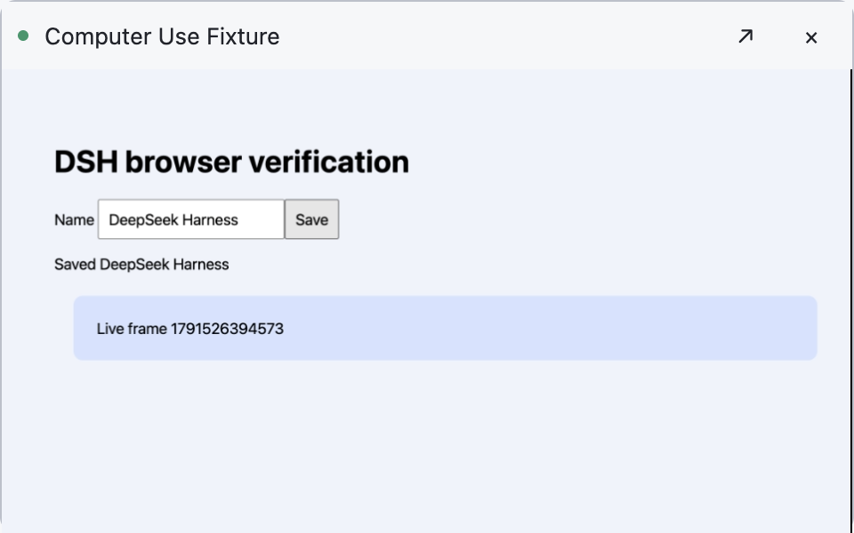
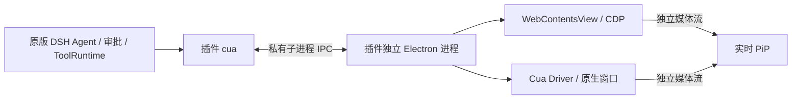

# DSH Unified Computer Use

[](https://github.com/xiaoiver/dsh-unified-computer-use/actions/workflows/ci.yml) · [MIT](LICENSE)

Unified browser/native computer use and live picture-in-picture for DeepSeek Harness. **Runs in a plugin-owned desktop companion. No DSH host patches or rebuilds.**

为 DeepSeek Harness 提供统一 `cua` 工具、独立多标签浏览器和实时画中画。插件管理自己的 Electron 桌面进程，直接安装到现有 DSH profile，**不修改 DSH 源码，不需要重新编译 Desktop**。

首版支持 **macOS Apple Silicon（arm64）**，已测试 Harness **0.2.0-rc.2**、Electron **44.7.0**、Cua Driver **0.34.0**。浏览器是独立窗口，不嵌入 DSH 现有侧栏。Windows / Linux / Intel Mac 暂不支持。

## 安装

**DSH Desktop：通过应用内插件管理器安装。** 打开侧栏的「插件」→「添加插件」，在包名 / 安装地址输入框粘贴：

```sh
github:xiaoiver/dsh-unified-computer-use#v0.1.0
```

点击「安装」，完成后点击「立即启用」。在对话中要求使用 `cua` 打开网页或操作指定应用窗口即可；若应用提示需要重启，按提示操作。`desktop` profile 由 Electron 应用独占管理，CLI 会拒绝 `--profile desktop`，即使应用已退出也不能通过 CLI 安装或卸载。

**普通 CLI / Web profile：** 使用匹配版本的 DSH CLI 安装。**DSH Host 必须运行在你的本地 macOS 图形桌面会话中**；远程服务器上的 Host 不会操作你的本机桌面：

```sh
dsh plugin --profile your-profile add github:xiaoiver/dsh-unified-computer-use#v0.1.0
```

安装和首次使用的区别：

- 安装 bundle 自动注册 `cua` 工具，仓库已提交 `dist/`，没有 `prepare` 或其他安装时构建脚本。
- 第一次获准执行工具时，自动从 Electron 官方 GitHub Releases 下载固定版本运行时，校验随插件固定的 SHA-256 后解压。需要联网和几百 MB 磁盘空间；随后使用缓存，不需手工安装 Electron。
- 浏览器操作无需 macOS 辅助功能权限。原生应用操作和原生窗口预览需要系统辅助功能 / 屏幕录制权限，请按系统实际显示的进程名称授权（运行时为 Electron，应用名为 DSH Computer Use）。插件不会绕过系统权限。

也可使用本地包：`npm run pack` 生成 `.tgz`。Desktop 在「添加插件」输入框中填写该文件的绝对路径；普通 CLI / Web profile 使用 `dsh plugin --profile your-profile add /absolute/path/package.tgz`。目前未发布到 npm registry。

## 功能

| 能力 | 行为 |
| --- | --- |
| 统一工具 | `cua` 的 `browser` / `native` / `session` surface，经过 DSH ToolRuntime 和审批 |
| 独立浏览器 | 多标签、地址栏、后退 / 前进 / 刷新；可隐藏运行，通过 PiP 查看 |
| 浏览器操作 | AX 树、按需截图、导航、点击、填写、按键、滚动；操作后重新观察 |
| 原生窗口 | 按应用 pid / window ID 绑定目标，AX 与按需截图，后台投递；不自动切前台重试 |
| 实时 PiP | 浏览器 frame / 确切原生窗口的独立视频流，无音频；不通过工具截图轮询 |
| 控制与回收 | 预览可拖动、缩放、关闭或显示源窗口；暂停 / 取消使观察失效，Agent 结束或插件卸载回收资源 |

关闭 PiP 不关闭目标。关闭最后一个 Agent 的资源会退出插件桌面进程；`session/reset` 后再次调用将启动新进程。DSH 崩溃 / IPC 断开时桌面进程自行退出。输入结果不确定时不会自动重放。

不包含现有侧栏标签接管、外部 Chrome 扩展、登录配置迁移、文件上传下载、密码管理器、录屏或完整跨平台支持。复用 DSH 的标准工具 / PTC 调用机制，没有另建持久 `cua_repl`。



## 架构与数据



插件不向 DSH 的父进程发送 IPC，不加载到 DSH Electron 主进程中，也不开 HTTP 控制服务或远程调试端口。模型不能指定可执行文件、原始 CDP 命令或任意脚本。每个 live Agent 有独立 owner 和目标集合。

默认运行时缓存位于 `~/Library/Caches/dsh-unified-computer-use/`。下载和解压后的 Electron 可跨会话复用；临时 companion profile 正常退出时删除。浏览器标签使用内存 partition，会话结束不保留网站登录。强制终止或系统崩溃可能留下临时缓存，下次完全退出后可清理该目录。原生应用文档由其应用持有，插件释放控制不会关闭应用或删除文档。

## 配置

默认配置在 `cordis.patch.yml`，可通过 DSH 的配置界面或 profile override 修改 `unified-computer-use` 行。

| 字段 | 默认 | 说明 |
| --- | --- | --- |
| `approval` | `ask` | 每次浏览器 / 原生操作要求审批；`inherit` 交给已有 DSH 策略，仍保留已有拒绝与审批 |
| `native` | `true` | 设为 false 只使用浏览器，不加载原生库 |
| `pip` | `true` | 实时预览 |
| `timeoutMs` | `30000` | 单次桌面操作期限（1–120 秒） |
| `startupTimeoutMs` | `180000` | 首次下载 / 桌面进程启动期限（1–600 秒） |
| `idleTimeoutMs` | `600000` | 无进行中调用时的目标回收期限（10 秒–1 小时） |
| `maxTargets` | `12` | 每个 Agent 的浏览器 / 原生目标分别最多 12 个 |
| `runtimeDirectory` | 空字符串 | 使用上述缓存目录；可设绝对路径 |
| `electronExecutable` | 空字符串 | 自动下载；离线环境可指定已安装的 **44.7.0 Electron 分发版**可执行文件绝对路径，不是 DSH 可执行文件 |

`open.visible` 默认 true，设为 false 可隐藏浏览器主窗口。PiP 自动出现不激活源窗口；`reveal` 或用户主动切换会显示源窗口。

## 调用示例

```json
{"surface":"browser","operation":{"action":"open","url":"https://example.com","visible":false}}
```

使用返回的 target UUID 和最新观察中的 ref；以下占位符不能直接执行：

```json
{"surface":"browser","operation":{"action":"fill","target":"<target UUID>","ref":"<当前 ref>","text":"Hello DSH"}}
```

```json
{"surface":"browser","operation":{"action":"observe","target":"<target UUID>","screenshot":true}}
```

原生流程：`apps` → `windows(pid)` → `select(pid, windowId)` → `act` → `observe`。`act.tool` 支持 `click`、`set_value`、`type_text`、`press_key`、`hotkey`、`drag`、`scroll`：

```json
{"surface":"native","operation":{"action":"act","target":"<target UUID>","tool":"set_value","args":{"element_token":"<AX token>","value":"Hello DSH"}}}
```

原生坐标操作需先显式截图观察；不能覆盖 pid、window ID、session、投递方式或输出文件路径。`close` 释放目标控制和预览，不退出用户应用。

在 DSH PTC 模式下可调用 `await tools.cua({...})`，每次调用仍经过审批。网页与 AX 内容是外部输入，不应作为上级指令执行。

```json
{"surface":"session","operation":"reset"}
```

进程故障、过期或取消后先 reset，再发现 / 打开目标并重新观察。首次下载失败可检查网络后 reset 重试；不要在同一失败操作中自动重复输入。

## 禁用、卸载与开发

Desktop 在侧栏「插件」中禁用或卸载本插件；按应用提示重启。普通 CLI / Web profile 停止运行后可通过 CLI 卸载：

```sh
dsh plugin --profile your-profile remove dsh-unified-computer-use
```

运行时缓存可保留供重新安装复用，或在相关进程全部退出后删除。

```sh
npm ci --ignore-scripts
npm run typecheck
npm test
npm run build
npm run pack
```

CI 检查类型、单元测试、构建产物一致性和包内容。修改 `src/` 后一同提交 `dist/`。真实桌面与安装验证见 [VERIFICATION.md](VERIFICATION.md)。

## 社区与许可证

本项目是独立社区插件，使用 `dsh-plugin` topic 供发现，不代表 DeepSeek 官方背书。欢迎在本仓库提 issue / PR；不向 DSH 主仓库提交补丁。dsh.pub 是可选收录渠道，当前尚未提交。

代码采用 [MIT](LICENSE)。Electron、Cua Driver 和 DSH 依赖保留各自许可证。发布形式遵循 [DSH 插件文档](https://deepseek-harness.github.io/deepseek-harness/en/develop/basic/publish) 和 [CONTRIBUTING](https://github.com/deepseek-ai/deepseek-harness/blob/master/CONTRIBUTING.md)。
