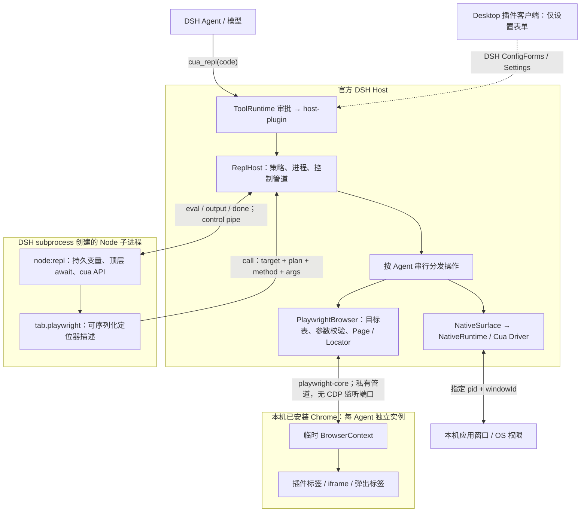
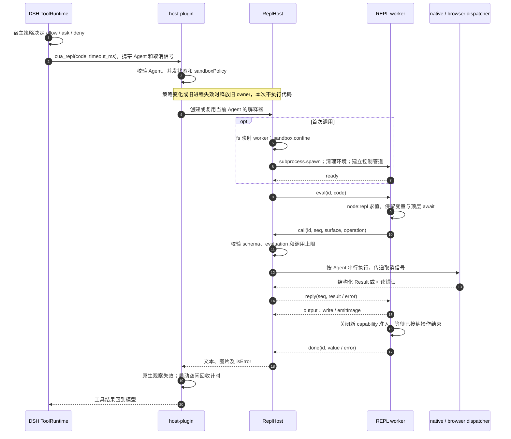
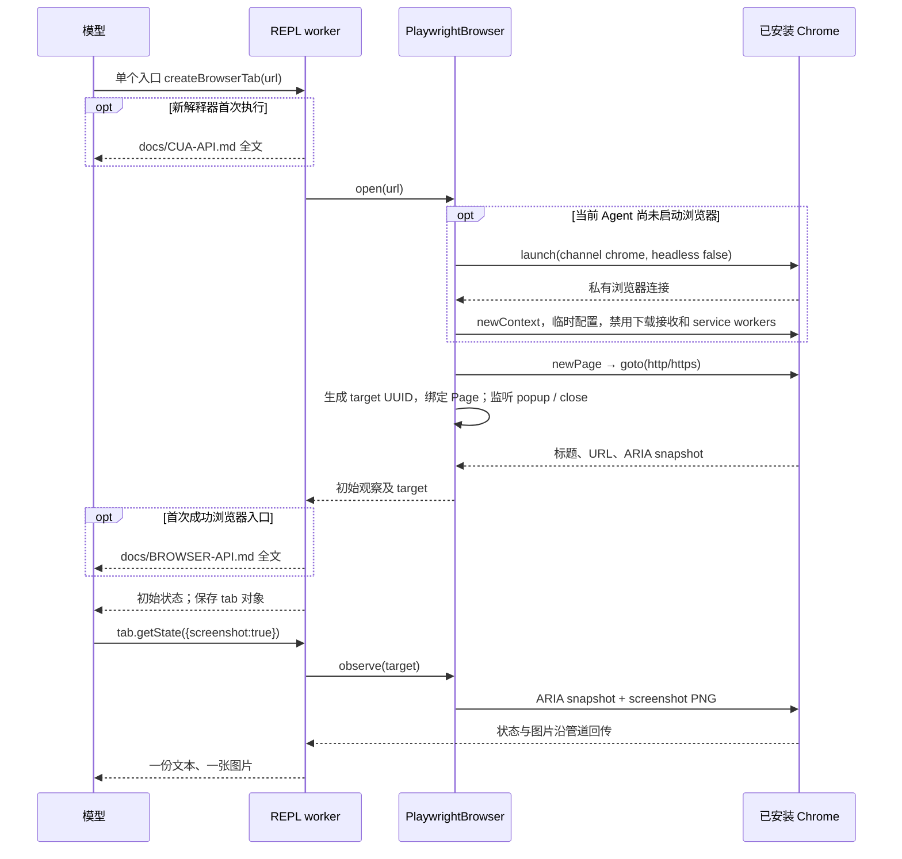
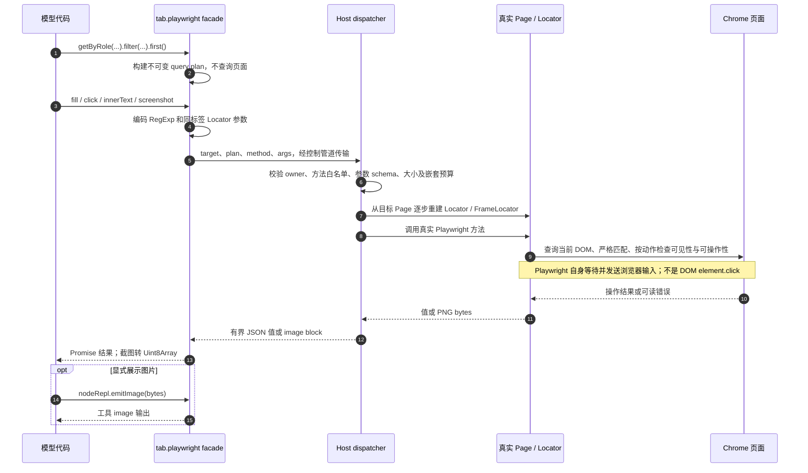
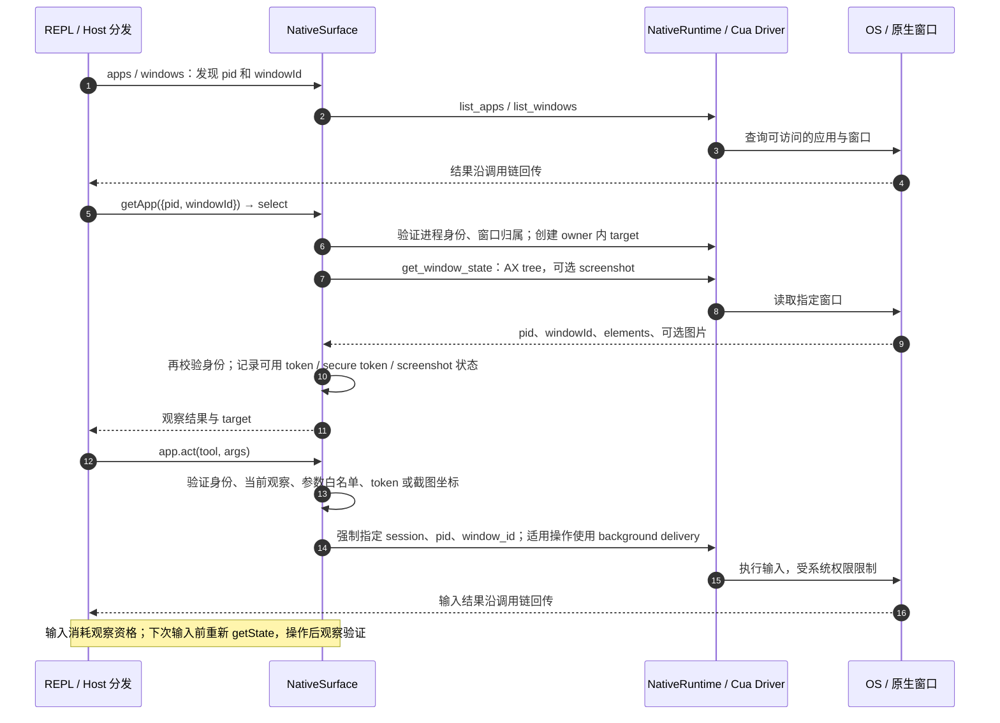
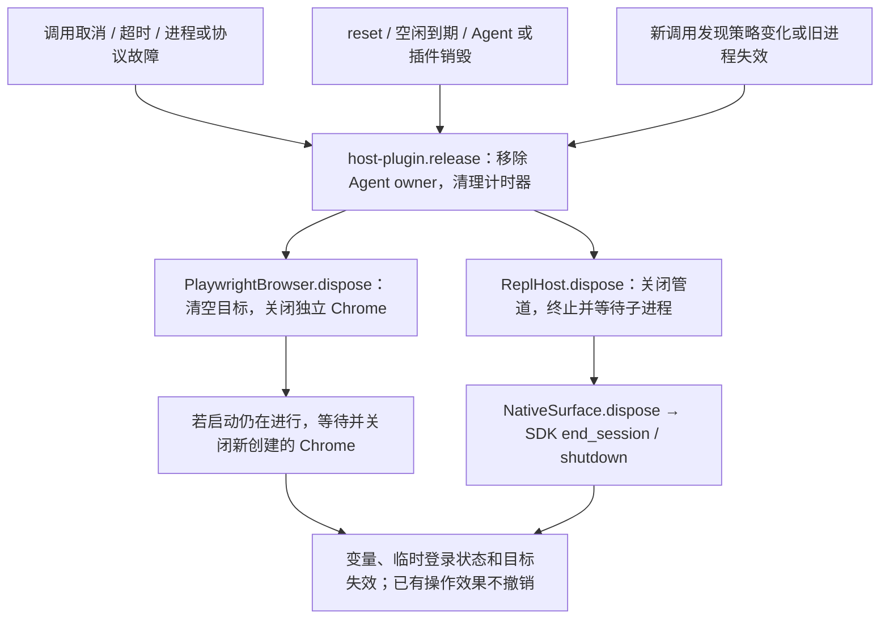
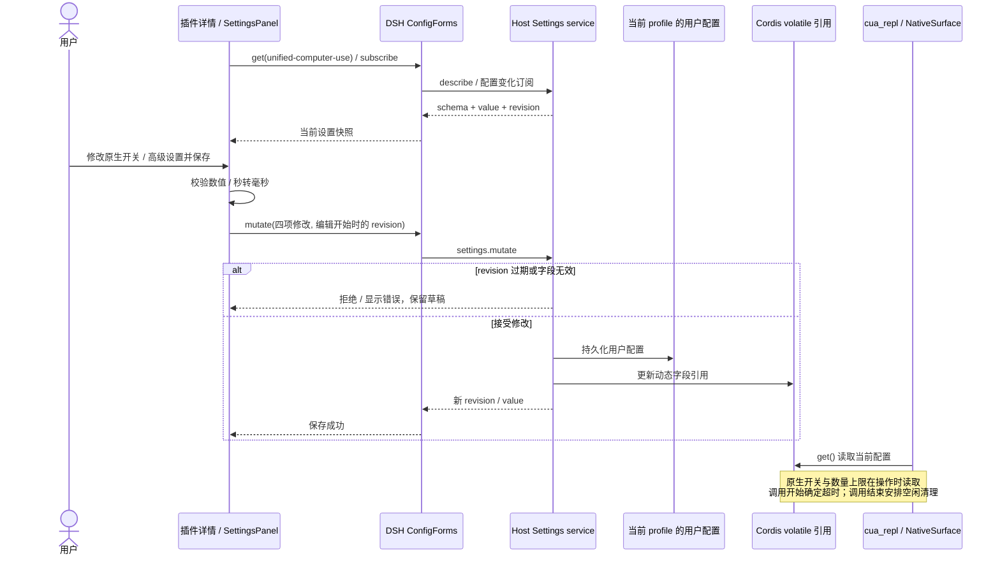

# Host 后端详细调用图

对应当前 `0.2.0-alpha.6` 源码、官方 DSH `0.2.0-rc.2`。Desktop 无需补丁；浏览器使用本机已安装的 Google Chrome，独立窗口可见，不嵌入 Desktop 侧栏。没有独立实时 PiP。安装和实测范围见 [README](../README.md) 与 [VERIFICATION](../VERIFICATION.md)。

## 1. 进程和组件总览

解释器复用 Host 的 `process.execPath`；Electron Host 下为子进程设置 `ELECTRON_RUN_AS_NODE=1`，不下载另一套 Electron。Playwright 在 Host 中按需加载，用固定 `channel: chrome` 启动可见窗口；不连接日常 Chrome，也不复用用户配置或登录状态。原生 SDK 同样在 Host 侧执行。

解释器的文件访问由 DSH 当前沙箱策略约束，`danger-full-access` 不做 OS 沙箱封装。解释器可调用 Node API，因此 `cua` 参数限制不是整个 JavaScript 环境的安全边界。Chrome 由 Host 启动，不在 REPL 文件沙箱中；网页使用 Chrome 沙箱，CUA 接口不提供文件路径、原始上下文或任意页面求值。

## 2. 每个调用的执行与回传

默认调用时限 30 秒，`timeout_ms` 可覆写至 120 秒。普通求值错误不必销毁解释器；取消、超时、协议错误或输出超限会释放整个 owner。每次调用最多 16 个未完成 capability 操作，累计最多 256 个；协议帧和累计输出有 4 MiB 上限。旧异步回调不能借用后续调用执行 `cua`。

## 3. API 文档与浏览器生命周期

`getBrowser()` 只准备浏览器，`listTabs()` 不主动启动 Chrome；每个 Agent 最多 12 个标签，弹出标签纳入同一目标表，超出的标签立即关闭。只有本 owner 的 UUID 可用于绑定；已关闭或其他 owner 的目标会被拒绝。

通用和浏览器 Markdown 是直接构建输入，模型收到的就是仓库中的文档。每个解释器记录独立的展示状态；首次入口失败不消费浏览器文档状态。`rewriteDocumentation()` 重读已引入文档，不访问目标。观察的 `emit:false` 关闭自动输出，已自动输出的对象不会再次作为最终值打印。

## 4. Playwright 定位器、自动等待和截图

接口支持语义定位、CSS 定位、组合过滤、同标签嵌套定位器、跨源 iframe、表单输入、可信鼠标键盘事件和截图。具体方法及支持选项见 [Browser API](BROWSER-API.md)。定位器在每次操作时由真实 Playwright 求值，保留严格匹配和自动等待；单纯读取或 `all()` 不额外等待动态列表稳定。

默认动作时限 10 秒，导航 15 秒，外层调用时限始终有效。定位器链最多 24 步，嵌套深度 6，总解析预算 128 步；请求最多 64 KiB，普通返回值 256 KiB，ARIA snapshot 截断至 64000 字符，PNG 原始字节最多 2.5 MB。模型不能传入启动参数、CDP 地址、截图保存路径、文件上传路径或页面求值函数。

截图接口返回真实 PNG，`nodeRepl.emitImage` 负责显示；没有自动截图循环或视频流。浏览器对话框自动取消，下载不接收，系统权限需要用户手动处理。

## 5. 原生应用：观察、校验和输入

每次 cell 结束也会使原生观察 token 失效，即使 `app` 对象仍保存在 REPL 中。窗口身份改变时撤销 target，不自动选择别的窗口。原生 `app.close()` 只释放插件目标句柄，不退出用户应用；浏览器 `tab.close()` 则会关闭本插件创建的 Chrome 标签。

原生 SDK 的权限查询已在真实 Host 验证；此 alpha 的原生输入还没有在已安装 Desktop 中逐项验收。图中表示已实现的调用路径，不代表每种动作都已经完成实际 UI 验收。

## 6. 取消、重置与释放

浏览器执行器收到取消信号后也会主动关闭 owner 的 Chrome，防止超时后的等待动作继续输入。取消后不自动重放操作；可能已经提交的网页操作不会撤销。普通 Playwright 动作失败可重新观察后处理；关闭整个独立 Chrome 后需重置工具再创建绑定。

## 7. Desktop 插件配置保存与动态生效

客户端从 Desktop 已加载的 `@deepseek-ai/dsh-client-ui-primitives` 复用 `SettingsForm`、`SettingsValueField` 和 `Switch`，构建将它声明为 external，不复制另一套 React 或控件样式。

设置词典通过 `ctx.locale.register` 注册中英文，插槽声明 `locale`，由 DSH renderer 注入响应语言切换的 `t`。字段、校验和保存结果都在渲染时翻译；没有恢复默认或重新载入按钮，过期 revision 仍拒绝写入，用户重新打开页面后读取最新配置。

插件以 npm 包名 `dsh-unified-computer-use` 注册到 `plugins.bundle.config` 详情插槽，以 Loader entry id `unified-computer-use` 访问 Host 配置。四个字段都声明为 `.volatile()`；Host 直接接收这些引用，以 `.get()` 读取，避免复制配置或保存后重建整个 REPL。插件没有额外的审批中间件；allow / ask / deny 完全由 DSH 工具运行时处理。

源码：[配置表单](../src/settings-client.ts)、[输入校验](../src/settings-model.ts)、[配置 schema](../src/index.ts)、[执行侧读取](../src/host-plugin.ts)。隔离 profile 的 [stock DSH 验收](../test/installed-settings.mjs) 覆盖 DSH 的允许 / 审批 / 拒绝、状态保留、原生禁用、冲突拒绝、策略拒绝和重启持久化。

## 8. 启用后的系统权限设置

插件以 npm 包名注册 `plugins.bundle.activation`，在用户启用后提供进入详情页或稍后设置的引导。详情页的权限面板使用 DSH Remote 调用 Host 服务 `unifiedCuaPermissions`；Host 和 Client 共享严格的参数 / 结果描述。此服务不注册为 Agent 工具，不要求会话或 REPL 已存在。

打开详情页、返回窗口和点击「重新检测」只调用 `query()`。只有用户点击「授权所需权限」才调用 `request()`；SDK 的 `currentMacOsPermissionStatus()` 和 `requestMacOsPermissions()` 在实际运行 `NativeRuntime` 的 Host 进程中执行，不创建 Driver。申请后重新查询真实状态，不将申请函数的返回值假定为授权成功。并发申请合并，原生开关关闭或插件卸载时拒绝申请。

`openSettings(permission)` 只接受 `accessibility` / `screenRecording`，打开固定的 macOS 隐私设置 URL。远程 Host 的授权在 Host 所在机器完成；非 macOS Host 不加载此权限 SDK。设置服务缺失时不阻止最小 / headless Host 的工具注册。

实际原生操作继续遵守权限：辅助功能缺失时，操作返回进入插件设置的提示；屏幕录制仅在请求原生截图时要求。只读权限诊断、应用发现和 Chrome 浏览器操作保持可用。

源码：[权限面板与启用引导](../src/permissions-panel.ts)、[Host 设置服务](../src/permissions-host.ts)、[同进程原生权限接口](../src/permissions-native.ts)、[共享 Remote 契约](../src/permissions-contract.ts)。

## 9. 源码入口与验证映射

| 职责 | 源码 | 验证 |
| --- | --- | --- |
| 工具、审批接入、Agent 生命周期 | [host-plugin.ts](../src/host-plugin.ts) | stock DSH 安装、审批拒绝、超时和策略变更 |
| 进程、控制协议、持久解释器 | [repl-host.ts](../src/repl-host.ts)、[repl-worker.ts](../src/repl-worker.ts) | 进程测试、真实沙箱写入拒绝、文档分层 |
| 可序列化定位器与参数白名单 | [playwright-facade.ts](../src/playwright-facade.ts)、[browser-contract.ts](../src/browser-contract.ts) | 正则、嵌套定位器、跨标签拒绝、受限方法 |
| 真实 Chrome 和 Playwright | [browser-playwright.ts](../src/browser-playwright.ts) | 可见 Chrome、可信输入、自动等待、跨源 iframe、PNG、popup、超时关闭 |
| 原生窗口约束与 SDK | [native.ts](../src/native.ts) | 参数和观察约束、无提示权限查询 |
| Desktop 插件设置 | [settings-client.ts](../src/settings-client.ts) | stock Settings 动态生效和重启持久化 |
