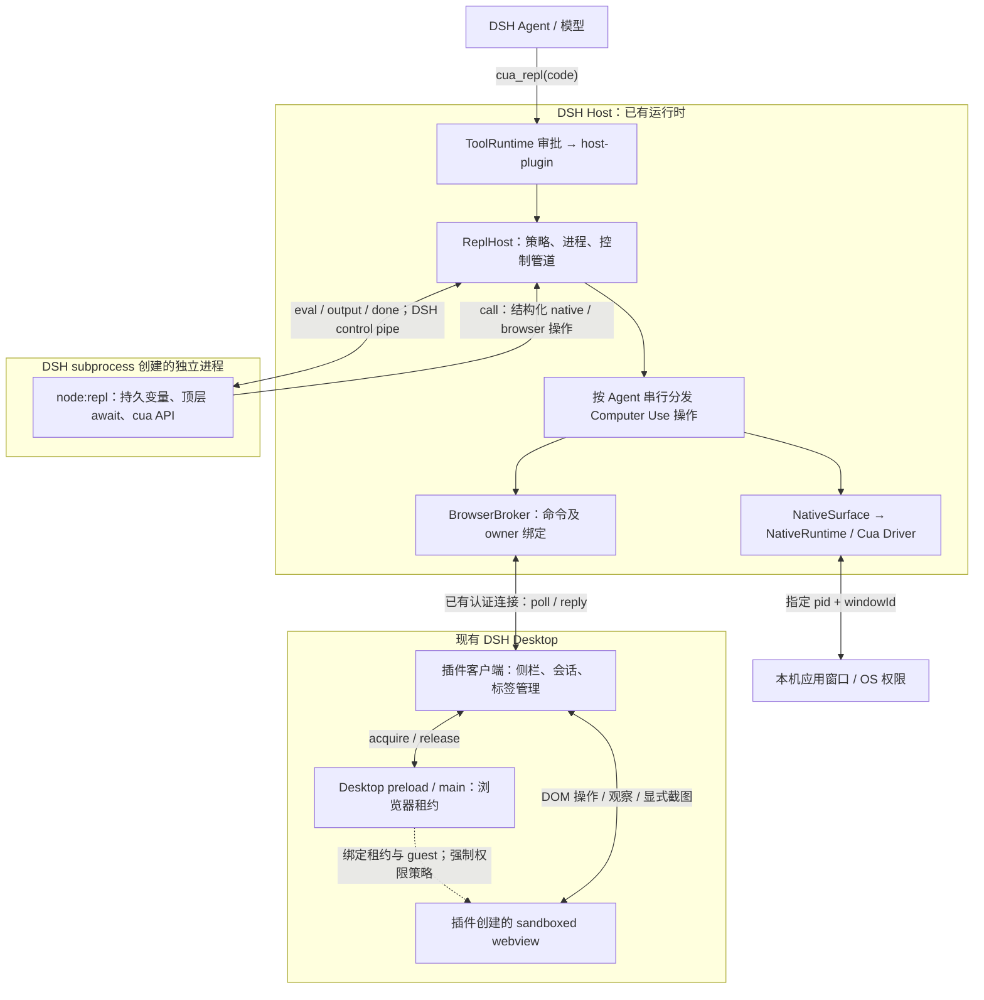
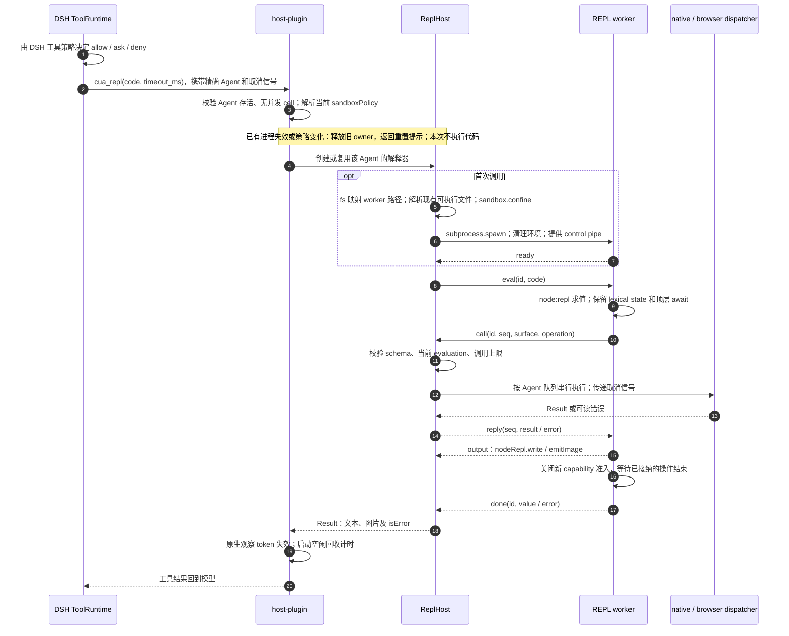
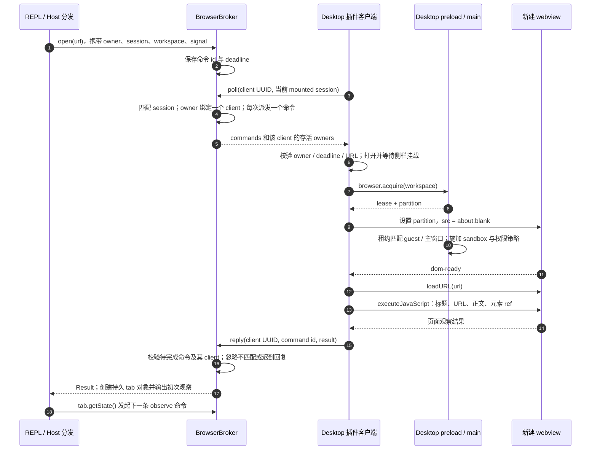
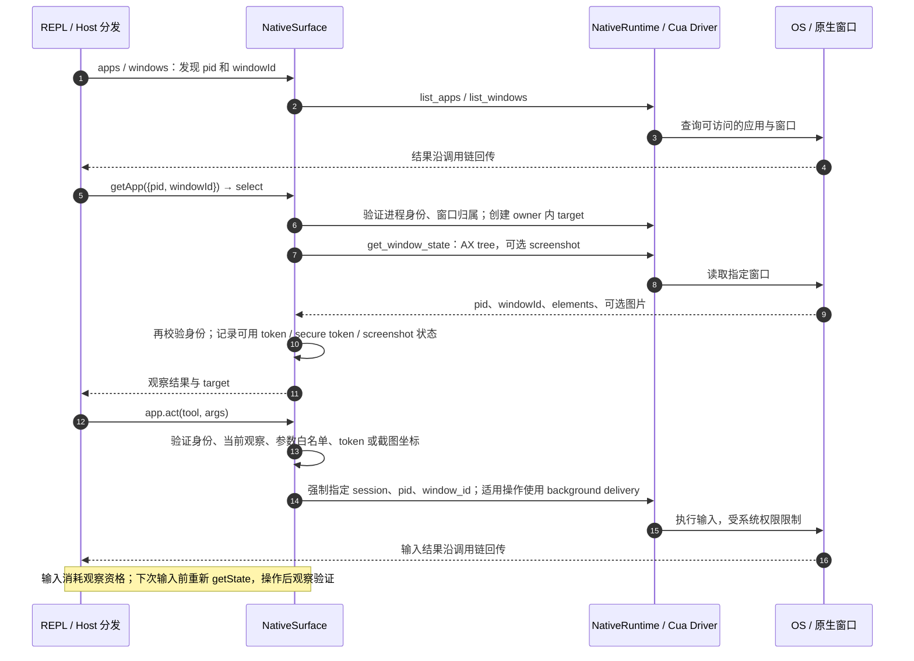
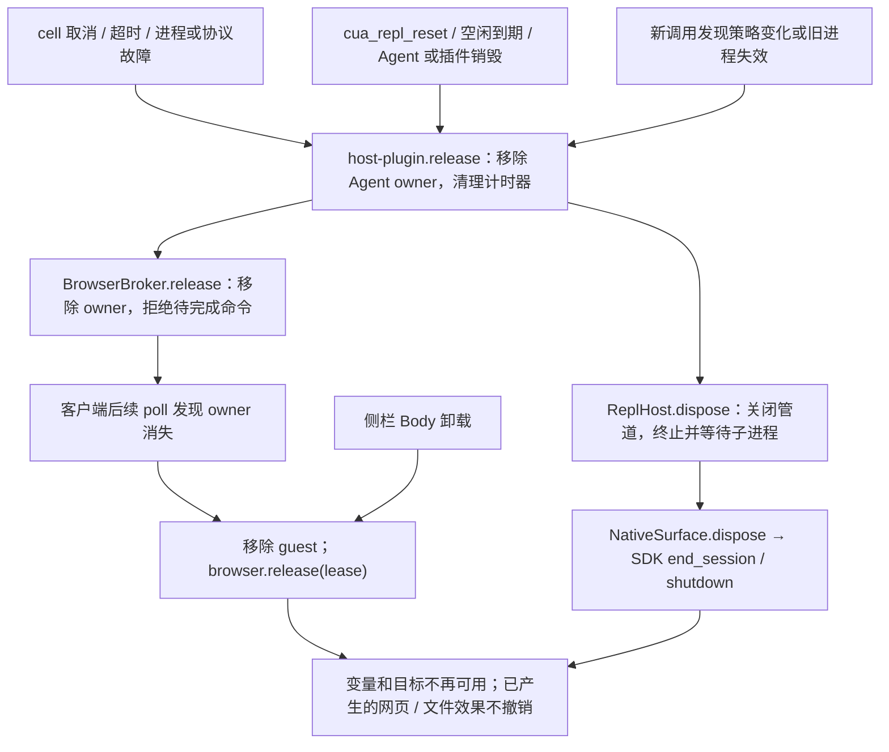
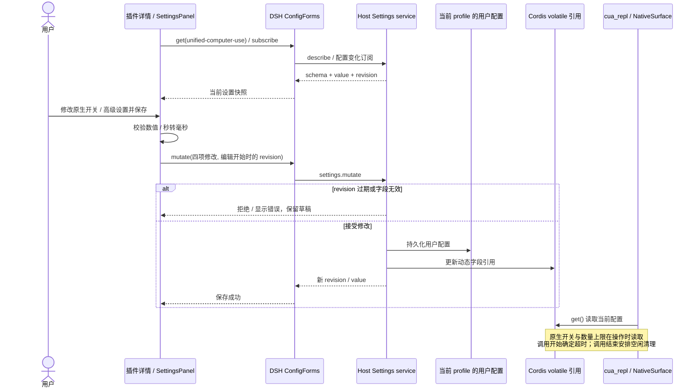

# Host 后端详细调用图

对应 `0.2.0-alpha.4`、DSH `0.2.0-rc.2`。图中描述的是当前实现；独立实时 PiP、Playwright / CDP 和可信浏览器键鼠输入不在这条调用链中。安装与验证范围见 [README](../README.md) 和 [VERIFICATION](../VERIFICATION.md)。

## 1. 进程和组件总览

这里仍有一个独立 **Node REPL 子进程**，但不下载或启动另一套 Electron 应用。`ReplHost` 使用 Host 的 `process.execPath`；Host 本身在 Electron 中运行时，为子进程设置 `ELECTRON_RUN_AS_NODE=1`。浏览器网页由现有 Desktop 的 guest 进程承载。原生 SDK 在 Host 侧按需加载，不在 REPL 子进程中执行。

Node 文件访问由 DSH 当前沙箱策略约束；`danger-full-access` 不做 OS 沙箱封装。REPL 可以调用 Node API，图中的结构化 `cua` 分发并不是限制所有 JavaScript 行为的安全边界。

## 2. 每个 REPL cell 的执行与回传

默认 cell 时限 30 秒，可通过 `timeout_ms` 配置至 120 秒。普通语法 / 求值错误返回 `isError`，已建立的变量可继续使用；进程取消、超时、协议错误或输出超限会关闭解释器。每个 cell 最多 16 个未完成 capability 调用、累计最多 256 个；协议帧及累计输出受 4 MiB 上限约束。旧异步回调不能在后续 cell 中继续调用 `cua`。

## 3. 浏览器：从创建标签到读取网页

客户端通过 `connection.rpc.call('/api', 'unified-cua/poll', ...)` 和 `reply` 使用 DSH 现有连接；Host 注册 `/api/unified-cua/poll`、`/api/unified-cua/reply` 精确 Fetch 路由，与 rc.2 gateway 的 `/api` 拦截器共存。客户端必须运行在受信任的 `dsh-app://app` 页面且具有 `dshDesktop` bridge。没有额外 HTTP 服务或监听端口。

`poll` 是命令及 owner 状态轮询，Host 每次等待约 500 ms；**不是截图轮询，也不是视频流**。操作的客户端 deadline 当前固定为分发时起 30 秒，外层 cell 也有自己的超时；扩大 cell 时限不会扩大浏览器命令 deadline。

后续 `navigate / click / fill / scroll / observe / close` 复用同一分发路径。每个 target 必须归属于当前 owner。点击和填写只接受当前观察产生的 ref；导航会令 ref 失效。`click / fill` 通过 DOM 执行，随后返回新观察；密码和文件字段要求手动操作。截图只在显式请求时调用 `capturePage()`。`press` 当前直接返回不支持的错误。

## 4. 原生应用：观察、校验和输入

每次 cell 结束也会使原生观察 token 失效，即使 `app` 对象仍保存在 REPL 中。窗口身份改变时撤销 target，不自动选择别的窗口。原生 `app.close()` 只释放插件目标句柄，不退出用户应用；浏览器 `tab.close()` 则会移除本插件创建的 guest 并释放租约。

原生 SDK 的权限查询已在真实 Host 验证；此 alpha 的原生输入还没有在已安装 Desktop 中逐项验收。图中表示已实现的调用路径，不代表每种动作都已经完成实际 UI 验收。

## 5. 取消、重置与释放

浏览器清理由客户端异步跟进，不意味着 Host 返回错误时所有 guest 已同步消失。客户端断开会尝试释放其持有的目标；Desktop 自身也管理窗口与租约生命周期。取消后不会自动重放输入。普通 cell 求值错误与上述“解释器故障”不同，不必然触发整套释放。

## 6. 源码入口与验证映射

| 职责 | 源码 | 验证 |
| --- | --- | --- |
| 后端选择、工具注册、Agent 生命周期及策略 | [index.ts](../src/index.ts)、[host-plugin.ts](../src/host-plugin.ts) | stock 安装测试、Desktop 审批 |
| 进程启动、控制协议、持久解释器 | [repl-host.ts](../src/repl-host.ts)、[repl-channel.ts](../src/repl-channel.ts)、[repl-worker.ts](../src/repl-worker.ts) | 真实进程测试、沙箱写入拒绝、Desktop 跨调用变量 |
| 命令路由、session / owner / client 绑定 | [browser-broker.ts](../src/browser-broker.ts) | 真实 Connection 服务路由测试、完整 Web profile |
| 侧栏、租约、DOM 观察及输入 | [client.ts](../src/client.ts) | stock browser fixture；Desktop 打开及读取标题 |
| 原生 target 校验、SDK 调用 | [native.ts](../src/native.ts) | 参数与观察约束测试、真实 Host 无提示权限查询 |

当前代码和安装包不再包含独立 Electron / PiP 链路；实时画中画仍需验证或新增合适的 Desktop 宿主接口。

## 7. Desktop 插件配置保存与动态生效（alpha.5）

客户端从 Desktop 已加载的 `@deepseek-ai/dsh-client-ui-primitives` 复用 `SettingsForm`、`SettingsValueField` 和 `Switch`，构建将它声明为 external，不复制另一套 React 或控件样式。

设置词典通过 `ctx.locale.register` 注册中英文，插槽声明 `locale`，由 DSH renderer 注入响应语言切换的 `t`。字段、校验和保存结果都在渲染时翻译；没有恢复默认或重新载入按钮，过期 revision 仍拒绝写入，用户重新打开页面后读取最新配置。

插件以 npm 包名 `dsh-unified-computer-use` 注册到 `plugins.bundle.config` 详情插槽，以 Loader entry id `unified-computer-use` 访问 Host 配置。四个字段都声明为 `.volatile()`；Host 直接接收这些引用，以 `.get()` 读取，避免复制配置或保存后重建整个 REPL。插件没有额外的审批中间件；allow / ask / deny 完全由 DSH 工具运行时处理。

源码：[配置表单](../src/settings-client.ts)、[输入校验](../src/settings-model.ts)、[配置 schema](../src/index.ts)、[执行侧读取](../src/host-plugin.ts)。隔离 profile 的 [stock DSH 验收](../test/installed-settings.mjs) 覆盖 DSH 的允许 / 审批 / 拒绝、状态保留、原生禁用、冲突拒绝、策略拒绝和重启持久化。
